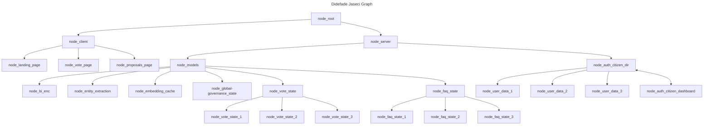

# DIDEGGO - Digital Intelligence Decentralized Global Governance - 🚧 Work In Progress 🏗

<p align="left"> 
 

</p>



## Building main.jac file

- Converting the pseudocode into Jac programming language:

```typescript
// import the graph, kb file, and walkers.
import {*} with "./server/models/faq-state/faq_graph.jac";
import {*} with "./server/models/faq-state/ask.jac";
import {*} with "./server/models/faq-state/kb.jac";

/// @notice this walker is reponsible for starting the program.
walker init {
    root {
        server = spawn here ++> graph::faq;
        spawn here walker::ingest_faq(kb_file="main_faq.json");
        while (true){
            spawn here walker::ask;
        }
    }
}
```

This project was generated with [Angular CLI](https://github.com/angular/angular-cli) version 15.2.0.
