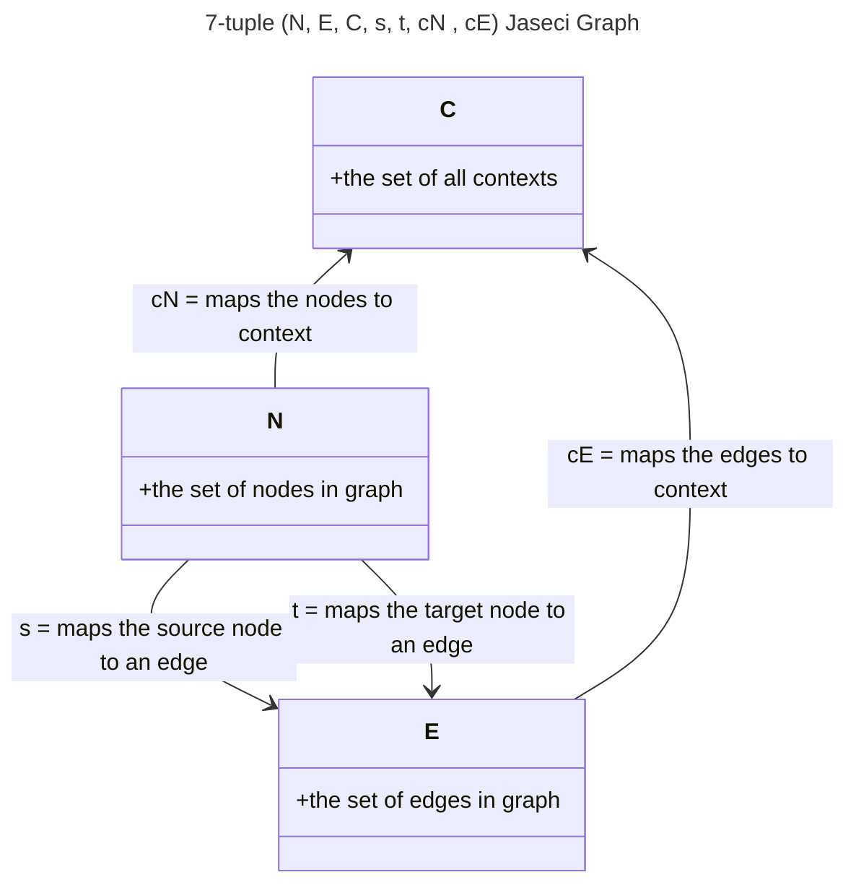
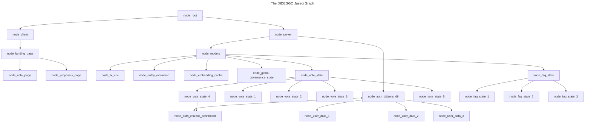

# DIDEGGO, DAO - Digital Intelligence Decentralized Global Governance, Decentralized Autonomous Organization - 🚧 Work In Progress 🏗

<p align="left"> 
 

</p>

## I am 💯% for individual freedom and autonomy.

```yml
The problem:
```

- Beyond personal autonomy, humans are incapable of governing other humans impartially, full-stop no debate.

- Humans are far too easily corruptable, one only needs to take an honest look at history to see this truth.
  - That is not to say that *all* persons in positions of power *will* ultimately become corrupted, *but*...
- Do we really want to continue to risk the chance of people in positions of power to ultimately become corrupted?


  - It's like we are rolling the dice and praying to RNGesus to keep us safe from corrupt people that seek positions of power, or from those that become corrupted after being seated in that position of power.
- Only *bat-shit* crazy people continue to do the same thing over, and over, and over, and over, expecting different results. 

```yml
The solution:
```

- The decentralized AI global governance model, will receive votes (one vote to one citizen, this removes centralized power and influence) and proposals directly from the citizens (all on the ethereum blockchain for transparency), completely removing the points of failure of current governing models used today: *the people in positions of power*.
  - By removing the source of corruption, (the few people in positions of power), that can and will most likey become corrupted from unsavory rich people.
  - This allows a society to self-govern with a incorruptible AI overseeing the process.
  - Keeping the autonomous governance model aligned with the country's consitutional framework.

- Ethereum smart contracts will control all governance treasuries to ensure the proper allocation of resources and funds, this will also provide further guard-rails against corruption.

## Technical Details

The structure of the progressive web app, will be in the form of a graph.

[reference: Jaseci Bible](https://github.com/Jaseci-Labs/jaseci/raw/main/support/bible/pdf/jaseci_bible.pdf)

```yml
Jaseci Graph described as a 7-tuple (N, E, C, s, t, cN , cE ), where:
```



- Nodes, edges, and walkers can all have abilities.
  - Abilities cannot interact outside of the context or local variables of the attached node, edge, or walker, and does not have a return.

An example of this would be a maintainer walker saving a user's id and last conversation state for continuing the conversation at a later time.

```yml
Saving state with a maintainer walker:
```

```typescript
can cleanup with talker entry{
    if (!vistor:hoping) {
       spawn *(global.node_conv_root_state) walker::maintainer(
            user_id = visitor.user_id,
            user_context = vistor.user_context,
            dialogue_context = vistor.dialogue_context,
            last_conv_state = vistor.state_for_continuing
            /// @dev Add ERC-4337 account abstractions or any other saved states, etc here.
       );
    }
}
```

- Creating mermaid diagrams as pseudocode:



## Building main.jac file

- Converting the pseudocode into Jac programming language:

```typescript
// import the graph, kb file, and walkers.
import {*} with "./server/models/faq-state/faq_graph.jac";
import {*} with "./server/models/faq-state/ask.jac";
import {*} with "./server/models/faq-state/kb.jac";

/// @notice this walker is reponsible for starting the program.
walker init {
    root {
        server = spawn here ++> graph::faq;
        spawn here walker::ingest_faq(kb_file="main_faq.json");
        while (true){
            spawn here walker::ask;
        }
    }
}
```

- In jaseci 1.4 or later, creating an edge uses the syntax `++>` and referencing an edge uses `-->`.

- Starting the Redis server

```bash
sudo service redis-server restart
```

## The real Jac programming language syntax highlighting in VS Code


```bash
Successfully installed PyPDF2-1.27.12 audioread-3.0.0 cffi-1.15.1 cython-0.29.34 hdbscan-0.8.29 hyperpyyaml-1.2.0 inflect-6.0.1 jaseci-ai-kit-1.4.0.3 librosa-0.9.2 llvmlite-0.39.1 numba-0.56.4 platformdirs-3.5.0 pooch-1.7.0 pycparser-2.21 pynndescent-0.5.10 resampy-0.4.2 soundfile-0.11.0 speechbrain-0.5.13 torchaudio-0.13.1 umap-learn-0.5.3 unidecode-1.3.6
```

This project's front-end was generated with [Angular CLI](https://github.com/angular/angular-cli) version 15.2.0.
