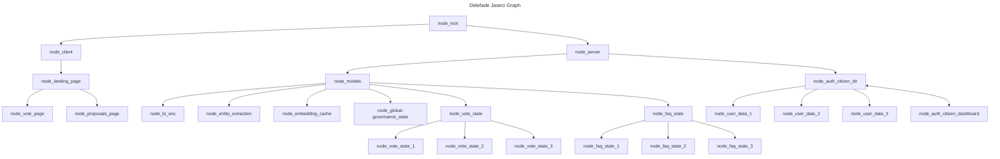

# DIDEGGO DAO - Digital Intelligence Decentralized Global Governance Decentralized Autonomous Organization - 🚧 Work In Progress 🏗

<p align="left"> 
 

</p>

```yml
The problem:
```
- Humans are far to easily corruptable, one only needs to take an honest look at history to see this truth.
  - That is not to say that *all* persons in positions of power *will* ultimately become corrupted, *but*...
- Do we really want to continue to risk the chance of people in positions of power to ultimately become corrupted?
  - It's like we are rolling the dice and praying to RNGesus to keep us safe from corrupt people that seek positions of power, or become corrupted after being seated in that position of power.

```yml
The solution:
```

- The decentralized AI global governance model, will receive votes and proposals directly from the citizens (all on the ethereum blockchain for transparency), completely removing the points of failure of current governing models used today, the people in positions of power.
  - By removing the source of corruption, (the few people in positions of power), that can and will most likey become corrupted from unsavory rich people, this allows a society to self-govern with a incorruptible AI overseeing the process and keeping the autonomous governance model aligned with the country's consitiutional framework.

- Ethereum smart contracts will control all governance treasuries to ensure the proper allocation of resources and funds, this will also provide further guardrails against corruption.



## Building main.jac file

- Converting the pseudocode into Jac programming language:

```typescript
// import the graph, kb file, and walkers.
import {*} with "./server/models/faq-state/faq_graph.jac";
import {*} with "./server/models/faq-state/ask.jac";
import {*} with "./server/models/faq-state/kb.jac";

/// @notice this walker is reponsible for starting the program.
walker init {
    root {
        server = spawn here ++> graph::faq;
        spawn here walker::ingest_faq(kb_file="main_faq.json");
        while (true){
            spawn here walker::ask;
        }
    }
}
```

This project was generated with [Angular CLI](https://github.com/angular/angular-cli) version 15.2.0.
