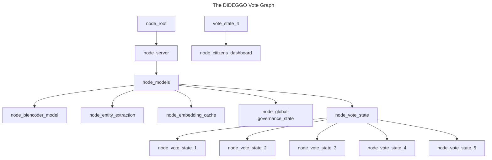

# Building vote_graph.jac file - Work In Progress

- Creating mermaid diagrams as pseudocode:



- Converting the pseudocode into Jac programming language:

```typescript
// Defining the nodes
node server;
node models;
node vote_state {
    has title;
    has message;
    has prompts;
}

edge transition {
    has intent;
}

// Static graph definition
graph vote {
    has anchor server;
    spawn {
        server = spawn node::server;
        models = spawn node::models;
        vote_state = spawn node::vote_state;
        vote_state_1 = spawn node::vote_state(
            title = "Welcome",
            message = "Welcome to DIDEGGO, how can I help?",
            prompts = ["Voting Page","Proposals Page","Citizens Dashboard","Quit"]
        );
        vote_state_2 = spawn node::vote_state(
            title = "Voting Page",
            message = "Welcome to DIDEGGO Voting! Are you ready to vote?",
            prompts = ["Yes", "Voting Page","Proposals Page","Citizens Dashboard","Quit"]
        );
        vote_state_3 = spawn node::vote_state(
            title = "Proposals Page",
            message = "Welcome to DIDEGGO proposals! Are you ready to create a proposal?",
            prompts = ["Yes", "Voting Page","Proposals Page","Citizens Dashboard","Quit"]
        );
        vote_state_4 = spawn node::vote_state(
            title = "Citizens Dashboard",
            message = "Welcome to your Citizens Dashboard! Would you like to update info?",
            prompts = ["Yes", "Voting Page","Proposals Page","Citizens Dashboard","Quit"]
        );
        vote_state_5 = spawn node::vote_state(
            title = "Quit",
            message = "Thank you for participating in DIDEGGO! Are you ready to leave the app?",
            prompts = ["Yes", "Voting Page","Proposals Page","Citizens Dashboard","Quit"]
        );

        vote_state_4 +[transition(intent="Citizens Dashboard")]+> node_citizens_dashboard;

        // Connecting the nodes together
        server ++> models;
        models ++> vote_state;
        vote_state ++> vote_state_1;
        vote_state ++> vote_state_2;
        vote_state ++> vote_state_3;
        vote_state ++> vote_state_4;
        vote_state ++> vote_state_5;
    }
}

walker init {
    root {
        spawn here ++> node::models;
    }
}
```
